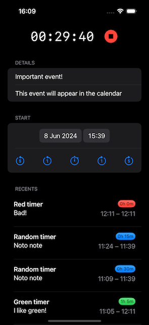

# Tracker

A simple time tracker iOS app with some Live Activities and background task support, built using SwiftUI.
The data lives in your system calendar as events.

This is an incomplete experiment.



## Features

- Start and stop a timer
- Manage calendar events with EventKit
- Display timer with Live Activities

## Installation

1. Clone the repository:
    ```bash
    git clone https://github.com/ubesluttsom/tracker.git
    ```
1. Open the project in Xcode:
    ```bash
    cd Tracker
    open Tracker.xcodeproj
    ```

## Usage

1. Build and run the app on your device or simulator.
1. Start the timer.
1. Stop the timer.
1. Manage events through the app interface, or in the system calendar.

## Structure

- `ContentView.swift`: Main view of the app.
- `ContentViewModel.swift`: ViewModel for managing timer and events.
- `AppDelegate.swift`: App delegate for handling background tasks.
- `TimerWidgetLiveActivity.swift`: Configuration for Live Activities.
