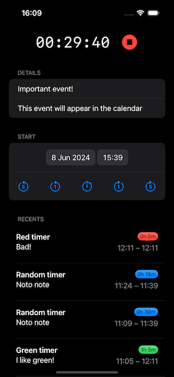

# Tracker

A simple time tracker iOS app with Live Activities, background task support, and tagging — built with SwiftUI and SwiftData.

This is an incomplete experiment.



## Features

- Start and stop a timer
- Tag sessions with custom labels
- Sessions stored in SwiftData, mirrored to the system calendar
- Display timer with Live Activities (Dynamic Island / Lock Screen)

## Installation

1. Clone the repository:
    ```bash
    git clone https://github.com/ubesluttsom/tracker.git
    ```
1. Generate the Xcode project and open it:
    ```bash
    cd Tracker
    xcodegen generate
    open Tracker.xcodeproj
    ```

## Usage

1. Build and run the app on your device or simulator.
1. Start the timer.
1. Stop the timer.
1. Manage sessions through the app interface, or view them in the system calendar.

## Structure

- `Tracker/Core/Models/Session.swift`: SwiftData model for timer sessions.
- `Tracker/Core/Services/SessionStore.swift`: CRUD operations for sessions.
- `Tracker/Core/Services/CalendarHelper.swift`: Calendar write-through sync.
- `Tracker/Features/Timer/ContentViewModel.swift`: Singleton view model for timer and session state.
- `Tracker/Features/Timer/TimerView.swift`: Timer display and controls.
- `Tracker/Features/Timer/TimerFormView.swift`: Title, notes, tags, and start time input.
- `Tracker/Features/Sessions/SessionListItem.swift`: Session row in lists.
- `Tracker/Features/Sessions/SessionDetailView.swift`: Session detail sheet.
- `Tracker/Features/Tags/TagInputView.swift`: Tag input with editable chips.
- `Tracker/Features/Tags/TagViews.swift`: Reusable tag chip and tag list components.
- `Tracker/App/AppDelegate.swift`: Background task handling for Live Activities.
- `TimerWidget/`: Widget extension for Live Activities and home-screen widget.
